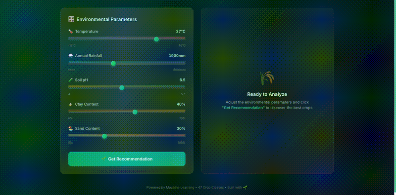

# soil-crop-recommender-ui

**AI-Powered Crop Recommendation System**


A full-stack machine learning application designed to help farmers and agricultural researchers identify the most suitable crops for specific environmental conditions. It uses global soil and weather data to train a robust recommendation engine.

---

## Table of Contents
- [Demo](#demo)
- [Context](#context)
- [Features](#features)
- [Installation and Setup](#installation-and-setup)
- [Data Requirements](#data-requirements)
- [How it Works](#how-it-works)
- [UI and Model Dependency](#ui-and-model-dependency)
- [Data Sources & Acknowledgments](#data-sources--acknowledgments)

---

## Demo



---

## Context

This repository is a standalone technical demonstration of an AI-powered crop 
recommendation system, developed as part of academic research.

The complete codebase — including the data processing pipeline, machine learning model, 
and React-based frontend — was independently designed and implemented by the author.

---

## Features

-   **Smart Scanner**: Automatically builds a training dataset by sampling global environmental layers (ERA5-Land, SoilGrids, SPAM).
-   **ML Pipeline**: Trains a Random Forest Classifier with high accuracy (Top-5 Accuracy > 95%).
-   **Modern Dashboard**: A sleek, responsive React frontend built with Framer Motion for a premium user experience.
-   **Production API**: A high-performance FastAPI backend serving predictions in real-time.

---

## Installation and Setup

### 1. Prerequisites
-   Python 3.9+ (Required for list type hint support)
-   Node.js 18.0+ (Required for Vite 5)

### 2. Backend Setup
```bash
cd backend
pip install -r requirements.txt
python main.py
```
*The API will run on http://localhost:8000*

### 3. Frontend Setup
```bash
cd frontend
npm install
npm run dev
```
*The Dashboard will run on http://localhost:3000*

---

## Data Requirements

Large datasets and trained model files are not included in this repository to keep the project lightweight. You must provide your own data files in the `data/` directory before running the scripts:

-   Weather data: **ERA5-Land**
-   Soil data: **SoilGrids**
-   Crop data: **SPAM** (Spatial Production Allocation Model)

**Note: This project is highly dependent on these specific datasets.** The data processing logic, physical scaling factors, and crop label mappings are specifically engineered to work with the structures and variables provided by ERA5-Land, SoilGrids, and SPAM. 

Furthermore, these are **not default versions** of the datasets. The SoilGrids data, for instance, was acquired using custom download settings to ensure its spatial resolution exactly matches the ERA5-Land resolution. Using raw or mismatched data sources without similar preprocessing will cause the spatial scanning logic to fail.

Due to these heavy dependencies on custom-processed data, the provided dataset and model building scripts (`1_build_global_dataset.py` and `2_train_model.py`) should be treated primarily as **guidelines and logical references**. Users are encouraged to study these scripts to understand the underlying sampling and categorization logic and then build their own customized data pipelines and training scripts tailored to their specific data sources and resolutions.

---

## UI and Model Dependency

The frontend is explicitly designed as a graphical interface for the underlying machine learning model. Because the model is intrinsically tied to the specific features extracted from ERA5-Land and SoilGrids, the UI is also inherently dependent on that data context.

The Dashboard is purpose-built to handle the five specific environmental variables (Temperature, Rainfall, pH, Clay, and Sand) that the model expects. Therefore, the UI should be viewed as part of a fixed vertical pipeline ranging from the specific dataset resolutions up to the final user interaction.

---

## How it Works
1.  **Data Ingestion**: `1_build_global_dataset.py` cross-references MapSPAM crop labels with ERA5 climate and SoilGrids physical data.
2.  **Model Training**: `2_train_model.py` categorizes 47 crops into 13 broad groups (e.g., Temperate Cereals, Tropical Fruits) to improve recommendation reliability.
3.  **Real-time Inference**: The React frontend sends environmental parameters (pH, Rain, Temp, etc.) to the FastAPI backend, which returns the top 5 most suitable crop categories.

---

## Data Sources & Acknowledgments

This project uses the following datasets:

- **MapSPAM (Spatial Production Allocation Model)** Guo, Z., S. Zhou, and L. You. (2024). *Global Spatially-Disaggregated Crop Production Statistics Data for 2020 Version 2.0*. International Food Policy Research Institute (IFPRI). [https://doi.org/10.7910/DVN/SWPENT](https://doi.org/10.7910/DVN/SWPENT)  
  License: [CC BY 4.0](https://creativecommons.org/licenses/by/4.0/)

- **ERA5-Land (Copernicus Climate Data Store)** Muñoz Sabater, J. (2019). *ERA5-Land hourly data from 1950 to present*. Copernicus Climate Change Service (C3S) Climate Data Store (CDS). [https://doi.org/10.24381/cds.e2161bac](https://doi.org/10.24381/cds.e2161bac)  
  *Attribution: Generated using Copernicus Climate Change Service information [2026].*

- **SoilGrids 2.0 (ISRIC — World Soil Information)** Poggio, L., de Sousa, L. M., Batjes, N. H., et al. (2021). *SoilGrids 2.0: producing soil information for the globe with quantified spatial uncertainty*. SOIL, 7, 217–240. [https://doi.org/10.5194/soil-7-217-2021](https://doi.org/10.5194/soil-7-217-2021)  
  License: [CC BY 4.0](https://creativecommons.org/licenses/by/4.0/)
